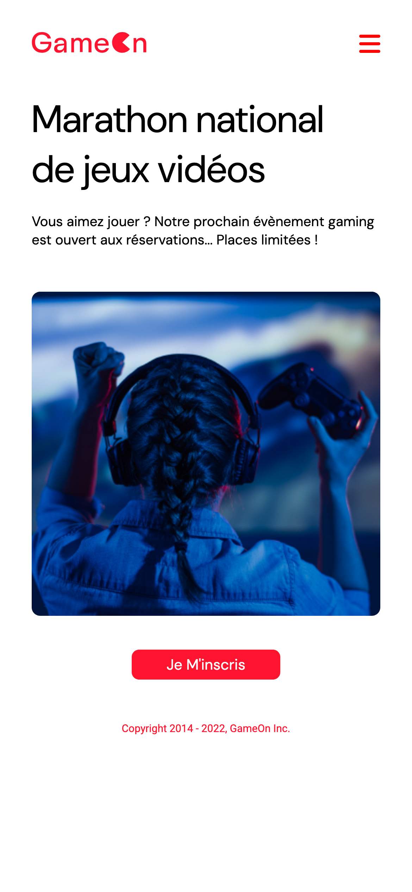
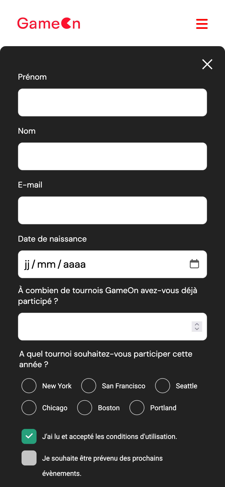
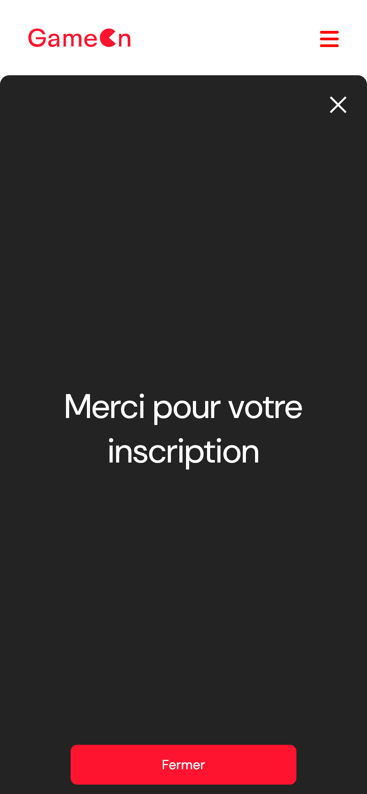

# Open Classrooms - Project 4 GameOn

## 📌 Description

Source code of **Project 4 - GameOn**: *Create a landing page with JavaScript*, completed as part of the **OpenClassrooms JavaScript React Developer path**.  

This project focuses on practicing **JavaScript form validation, with regular expressions, and DOM manipulation**.

⚠️ **Educational project**: This repository was created for learning purposes during my training. It is **not intended for production use**.

---

## 🎯 Learning Objectives

- Program in JavaScript

---

## 🔗 Provided Resources

- [Design template on Figma](https://www.figma.com/design/B7NKBDvSI18uoMLJgpnh48/UI-Design-GameOn-FR?node-id=106-630)
- [Base code repo on GitHub](https://github.com/OpenClassrooms-Student-Center/GameOn-website-FR/)
- [Open Issues on GitHub](https://github.com/OpenClassrooms-Student-Center/GameOn-website-FR/issues)

---

## 👀 Preview

| Home page                                             | Modal form                                          | Confirmation page                                                 |
|-------------------------------------------------------|-----------------------------------------------------| ----------------------------------------------------------------- |
|  |  |  |
|     |     |     |

🔗 [Live preview](https://sedomu.github.io/oc_p4_gameon/)

---

## 🏗 Project structure

- `index.html` → Main HTML file
- `modal.js` → JavaScript for handling modal display and form validations

---

## 🛠 Tech stack

- HTML5
- CSS3
- Vanilla JavaScript

---

## ✅ Code validation
The HTML and CSS code was validated using the official [W3C Markup Validator](https://validator.w3.org/nu/?doc=https%3A%2F%2Fsedomu.github.io%2Foc_p4_gameon%2F) and [W3C CSS Validator](https://jigsaw.w3.org/css-validator/validator?uri=https%3A%2F%2Fsedomu.github.io%2Foc_p4_gameon%2F&profile=css3svg&usermedium=all&warning=1&vextwarning=&lang=fr).
No errors were reported.

---

## ⚙️ Installation

### 📋 Requirements
- None (this project only requires a web browser)

### 🚀 Steps
Clone the repository:

```bash
git clone https://github.com/sedomu/oc_p4_gameon.git
```

Then simply open the file `index.html` in your web browser:

```bash
open ./src/index.html
```

### 🤖 Deployment

This project is automatically deployed to GitHub Pages via a GitHub Actions workflow.
No manual deployment steps are required.

---

## 📜 Scripts available

Not applicable – no build tools or package managers are needed for this project.

---

## ⚠️ Disclaimer

This is a **training project** created as part of the OpenClassrooms curriculum.  
Some implementations (e.g., accessibility, performance optimization, authentication) are simplified and may not meet production standards.

---

## ❌ Issues on the original repo

- [X] TODO : close the modal
- [X] Implement form entries
- [X] Add validation or error messages
- [X] Add confirmation when submitted successfully
- [X] Manual tests implementation protocol

---

## ✅ Tests protocol

Manual tests to verify form validation

| Description                                                                                       | Field                 | Value                  | Expected result             | Actual result               | Conclusion |
| ------------------------------------------------------------------------------------------------- | --------------------- | ---------------------- | --------------------------- | --------------------------- | ---------- |
| Correct form submission                                                                           | All                   | Valid inputs           | Access to confirmation page | Access to confirmation page | ✅         |
| Form validation                                                                                   | First name            | Cedric                 | ✅                          | ✅                          | ✅         |
| Form validation                                                                                   | First name            | Cédric                 | ✅                          | ✅                          | ✅         |
| Form validation                                                                                   | First name            | Marie-Alice            | ✅                          | ✅                          | ✅         |
| Form validation                                                                                   | First name            | Marie Alice            | ✅                          | ✅                          | ✅         |
| Form validation                                                                                   | First name            | C3dric                 | ❌                          | ❌                          | ✅         |
| Form validation                                                                                   | First name            | C                      | ❌                          | ❌                          | ✅         |
| Form validation                                                                                   | Last name             | Cedric                 | ✅                          | ✅                          | ✅         |
| Form validation                                                                                   | Last name             | Cédric                 | ✅                          | ✅                          | ✅         |
| Form validation                                                                                   | Last name             | Marie-Alice            | ✅                          | ✅                          | ✅         |
| Form validation                                                                                   | Last name             | Marie Alice            | ✅                          | ✅                          | ✅         |
| Form validation                                                                                   | Last name             | C3dric                 | ❌                          | ❌                          | ✅         |
| Form validation                                                                                   | Last name             | C                      | ❌                          | ❌                          | ✅         |
| Form validation                                                                                   | E-mail                | marie-alice@cedric.com | ✅                          | ✅                          | ✅         |
| Form validation                                                                                   | E-mail                | marie-alice@cedric.c   | ❌                          | ❌                          | ✅         |
| Form validation                                                                                   | E-mail                | marie.alice@cedric.com | ✅                          | ✅                          | ✅         |
| Form validation                                                                                   | E-mail                | marie_alice@cedric.com | ✅                          | ✅                          | ✅         |
| Form validation                                                                                   | E-mail                | marie-alice75@cedric.com | ✅                        | ✅                          | ✅         |
| Form validation                                                                                   | E-mail                | marie@alice75@cedric.com | ❌                        | ❌                          | ✅         |
| Form validation                                                                                   | E-mail                | marie-alice@cedric     | ❌                          | ❌                          | ✅         |
| Form validation                                                                                   | E-mail                | marie-alice@cedric.    | ❌                          | ❌                          | ✅         |
| Form validation                                                                                   | E-mail                | marie!alice@cedric.com | ❌                          | ❌                          | ✅         |
| Form validation                                                                                   | Birth date            | 01/01/2000             | ✅                          | ✅                          | ✅         |
| Form validation                                                                                   | Birth date            | cedric                 | ❌                          | ❌                          | ✅         |
| Form validation                                                                                   | Birth date            | 25                     | ❌                          | ❌                          | ✅         |
| Form validation                                                                                   | Birth date            | 28/02/2024             | ✅                          | ✅                          | ✅         |
| Form validation                                                                                   | Birth date            | 31/02/2025             | ❌                          | ❌                          | ✅         |
| Form validation                                                                                   | Birth date            | 29/02/2023             | ❌                          | ❌                          | ✅         |
| Form validation                                                                                   | Birth date            | 29/02/2024             | ✅                          | ✅                          | ✅         |
| Form validation                                                                                   | Birth date            | 31/12/2100             | ❌                          | ❌                          | ✅         |
| Form validation                                                                                   | Number of tournaments | 0                      | ✅                          | ✅                          | ✅         |
| Form validation                                                                                   | Number of tournaments | 1                      | ✅                          | ✅                          | ✅         |
| Form validation                                                                                   | Number of tournaments | 01                     | ✅                          | ✅                          | ✅         |
| Form validation                                                                                   | Number of tournaments | 99                     | ✅                          | ✅                          | ✅         |
| Form validation                                                                                   | Number of tournaments | 100                    | ❌                          | ❌                          | ✅         |
| Form validation                                                                                   | Number of tournaments | 099                    | ❌                          | ❌                          | ✅         |
| Form validation                                                                                   | Number of tournaments | -1                     | ❌                          | ❌                          | ✅         |
| Form validation                                                                                   | Number of tournaments | e                      | ❌                          | ❌                          | ✅         |
| Form validation                                                                                   | Radio buttons         | One selected           | ✅                          | ✅                          | ✅         |
| Form validation                                                                                   | Radio buttons         | None selected          | ❌                          | ❌                          | ✅         |
| Form validation                                                                                   | Checkbox T&C          | Checked                | ✅                          | ✅                          | ✅         |
| Form validation                                                                                   | Checkbox T&C          | Unchecked              | ❌                          | ❌                          | ✅         |
| Form validation                                                                                   | Checkbox Newsletter   | Checked                | ✅                          | ✅                          | ✅         |
| Form validation                                                                                   | Checkbox Newsletter   | Unchecked              | ✅                          | ✅                          | ✅         |
| Injection: forced `submit` click with 1 invalid field (`submitBtn.disabled = false;` via console) | Submit                | N/A                    | ❌                          | ❌                          | ✅         |

**Test conclusion**: All test cases passed successfully.
Form validation behaves consistently, as the same JavaScript logic is executed regardless of the display context (desktop or mobile). ✅